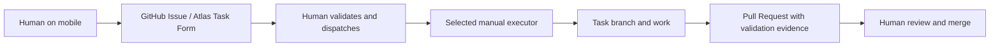
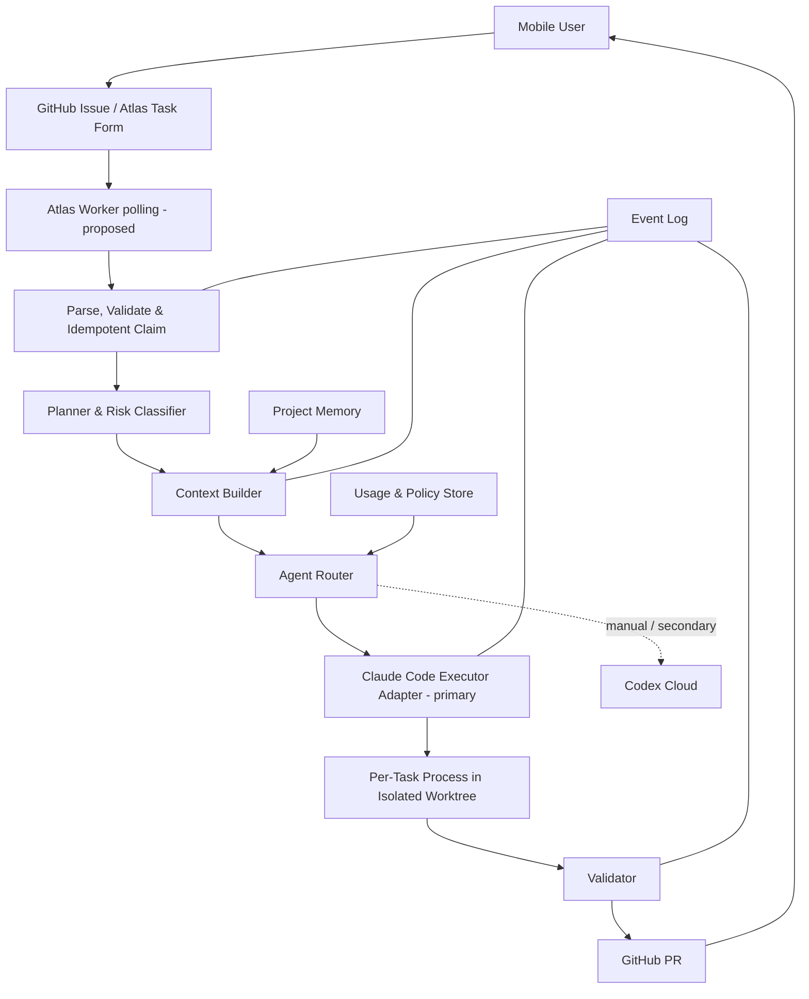
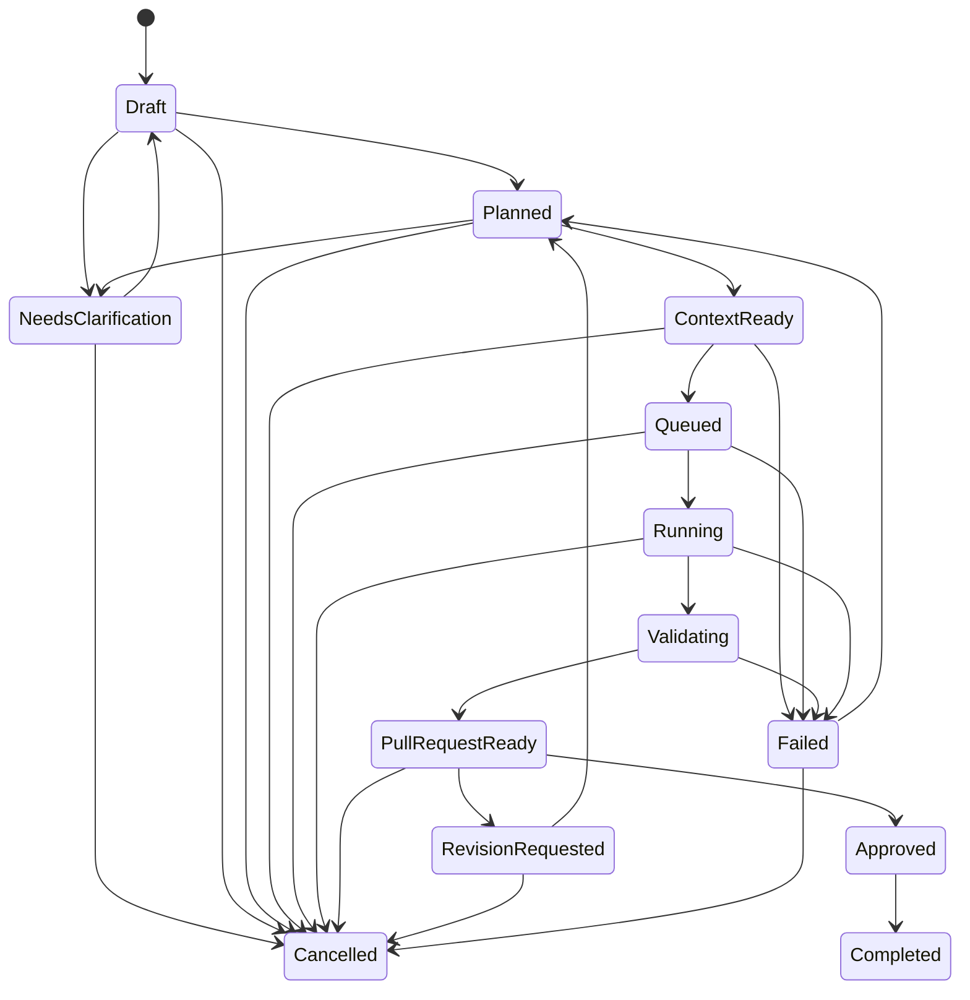

# Atlas System Architecture v0.2

> 상태: 초안
>
> 출처: [02. System Architecture v0.1](https://app.notion.com/p/3cd9f036b307811fb47ced775f939767) (2026-08-31 동기화)

> 운영 모델: [ADR-001](adr/0001-documentation-source-of-truth.md), [ADR-002](adr/0002-initial-mobile-task-channel.md), [ADR-003](adr/0003-initial-execution-environment.md) Accepted
>
> 검토 중인 runtime 방향: [ADR-008 polling-first](adr/0008-initial-github-event-ingestion.md), [ADR-009 process supervision](adr/0009-worker-process-supervision.md), [ADR-010 Task isolation](adr/0010-task-execution-isolation.md) Proposed

## Architecture Principles

- Control Plane과 Execution Plane을 분리합니다.
- 프로젝트 격리는 논리적 규칙이 아니라 자격증명, 경로, 런타임 수준에서 보장합니다.
- 에이전트는 교체 가능한 Adapter입니다.
- 모든 단계는 이벤트로 기록되고 재시작 가능해야 합니다.

## Current Manual Workflow

현재 repository에는 사람이 Issue 번호를 지정해 실행하는 manual intake CLI가 있습니다. 이 slice는 allowlist 안의 GitHub Issue 한 건을 fetch하고 Task 후보로 parse·validate합니다. Atlas worker, webhook/polling, 자동 claim, persistence, Claude Code invocation, Run validation automation은 없습니다.



사람이 Issue를 Executor에게 전달하는 단계가 현재의 dispatch와 claim을 대신합니다. Executor는 branch 생성, 작업, 검증, PR 생성을 수행하지만 `main`에 직접 반영하지 않습니다.

## Target MVP Architecture



## Core Components

### 1. Task Intake

Accepted intake channel인 GitHub Issues의 Atlas Task Form을 공통 Task Schema로 변환합니다. 현재 `src/atlas/`는 사람이 지정한 단건 Issue의 repository allowlist, form marker, 필수 field, scope, enum, Safety Confirmation을 검증하고 `Draft` 또는 `NeedsClarification` 결과를 출력합니다. in-process cache만 있으며 Task state를 저장하거나 claim하지 않습니다. Target MVP에서는 [ADR-008](adr/0008-initial-github-event-ingestion.md)의 Proposed 방향에 따라 worker가 approved/queued Issue를 polling한 뒤 같은 parser와 validator를 사용합니다.

### 2. Planner & Risk Classifier

작업을 하위 단계로 나누고 읽기 전용, 문서, 코드, 인프라, 비밀정보 관련 등 위험도를 분류합니다.

### 3. Context Builder

관련 문서, 코드, Issue, PR을 선택하고 크기 제한을 적용합니다.

### 4. Memory Store

프로젝트 규칙, ADR, Task 결과, 실패 원인, 요약을 저장합니다.

### 5. Agent Router

Target MVP에서는 primary self-hosted Claude Code Executor를 선택합니다. Codex Cloud는 사람이 배정하는 manual executor 또는 secondary 경로이며 Atlas-to-Codex automation은 feasibility가 검증되지 않았습니다. Atlas는 orchestrator이고 Role과 Executor account는 분리하며 자세한 registry contract는 [Agent Registry](specs/agent-registry.md)를 따릅니다.

### 6. Execution Runner

운영자가 관리하는 always-available server에서 worker가 저장소를 준비합니다. server를 사용하면 개인 PC는 꺼져 있어도 됩니다. [ADR-009](adr/0009-worker-process-supervision.md)은 PoC의 tmux 사용과 stable 단계의 systemd 또는 Docker 전환을 제안하고, [ADR-010](adr/0010-task-execution-isolation.md)은 Task별 branch, worktree/clone, executor process, Run ID, log scope를 제안합니다. 두 방향은 아직 Proposed이며 runtime은 구현되지 않았습니다.

worker는 한 Task를 claim한 뒤 새 executor process를 시작하고 stdout, stderr, metadata, heartbeat, validation evidence를 Run별로 수집합니다. timeout, cancellation, retry, cleanup, restart reconciliation은 [Execution Runtime](specs/execution-runtime.md)을 따릅니다. persistent Claude conversation, shell, tmux pane을 여러 Task나 Project가 공유하지 않습니다.

### 7. Validator

테스트, lint, 변경 범위, 금지 파일, secret scan을 검증합니다.

### 8. Delivery Adapter

GitHub PR, Issue comment, 모바일 알림을 담당합니다. GitHub Markdown과 GitHub Task state가 canonical이며 Notion update는 선택적인 mirror 동기화일 뿐 실행 상태의 source of truth가 아닙니다.

### 9. Project Lifecycle

Project는 product goals, canonical context, roadmap, Epic, 여러 Task와 반복 PR delivery를 포함할 수 있습니다. Planner는 breakdown을 제안하지만 사람이 roadmap 또는 Task batch를 승인해야 합니다. MVP는 [Project Lifecycle](specs/project-lifecycle.md)에 따라 한 번에 한 Task와 한 PR을 처리합니다.

## Initial Data Model

```text
Workspace
- id
- name
- credential_scope
- policies

Project
- id
- workspace_id
- repository
- default_branch
- context_manifest
- execution_policy

Task
- id
- project_id
- objective
- constraints
- acceptance_criteria
- risk_level
- status

Agent
- agent_id
- provider
- adapter_type
- execution_host
- authentication_profile
- capabilities
- availability
- supported_roles
- usage_state
- security_scope
- current_run

Run
- id
- task_id
- agent_id
- previous_run_id
- worker_id
- lease_owner
- lease_expires_at
- process_id
- branch
- worktree_path
- status
- started_at
- last_heartbeat_at
- completed_at
- timeout_at
- cancellation_state

Artifact
- id
- run_id
- type
- uri
- checksum
```

## State Machine



자세한 guard, retry, authorization은 [Task State Machine](specs/task-state-machine.md)을 따릅니다.

## Worker Recovery and Idempotency

- polling한 source revision과 approval/queue signal을 idempotency key로 사용합니다.
- active lease가 있는 Task에는 새 Run을 만들지 않으며 같은 Run의 PR을 중복 생성하지 않습니다.
- worker는 Task ID, Run ID, worker ID, lease owner/expiry, PID, branch, worktree path, start time, heartbeat를 기록합니다.
- restart 시 process identity, lease, branch, worktree를 reconcile하고 stale lease와 orphan resource를 안전하게 판정합니다.
- retry는 새 Run ID로 이전 Run과 failure reason을 참조하며 Acceptance Criteria와 scope를 조용히 바꾸지 않습니다.

구체적인 recovery와 cleanup 규칙은 [Execution Runtime](specs/execution-runtime.md)에 정의합니다. persistence와 recovery 구현은 아직 없습니다.

## Execution Options

### Accepted Primary — Self-hosted Claude Code Worker

- always-available server에서 실행합니다.
- Atlas worker가 검증·claim한 Task를 Claude Code Adapter에 전달합니다.
- Task별 branch, worktree/clone, 새 process, Run log, timeout, command policy, redaction이 필요합니다.
- polling-first, tmux PoC, isolation은 Proposed ADR이며 server hosting 위치와 stable supervisor는 미결정입니다.

### Manual / Secondary — Codex Cloud

- 사람이 Issue를 직접 전달하는 현재 manual executor로 사용할 수 있습니다.
- Target MVP에서 primary worker가 실행할 수 없을 때 secondary 경로로 유지합니다.
- Atlas-to-Codex 자동 invocation과 fallback은 feasibility validation 전까지 지원한다고 표현하지 않습니다.

### Deferred Adapters

- 개인 PC Runner와 다른 provider adapter는 primary E2E 이후 평가합니다.
- 모든 Adapter는 같은 Task, state, validation, PR contract를 따라야 합니다.

## Recommended MVP

[ADR-003](adr/0003-initial-execution-environment.md)에 따라 primary automated path는 **GitHub Issue → Atlas worker → self-hosted Claude Code worker → validation → PR → human review/merge**입니다. Codex Cloud는 manual/secondary로 유지합니다. 현재 이 경로 중 단건 Issue fetch·parse·validation core만 구현됐고 나머지 구성 요소는 구현되지 않았습니다.

## Recommended Next Sprint Scope

1. valid Atlas Task Issue 한 건으로 live fetch·parse·validation E2E를 확인합니다.
2. approved 또는 queued Task polling을 구현합니다.
3. idempotent claim과 duplicate Run/PR 방지를 구현합니다.
4. 최소 Task, Run, lease, heartbeat 상태를 persist합니다.
5. repository allowlist 아래 격리 worktree와 branch를 만듭니다.
6. provider-neutral contract를 따르는 mock executor를 새 process로 호출합니다.
7. scope·forbidden path·secret validation을 수행하고 draft PR을 생성합니다.
8. self-hosted Claude Code invocation은 별도 후속 PR에서 추가합니다.

다음 Sprint는 위 mock vertical slice에 한정하며 Claude Code invocation, multi-agent routing, automated Codex adapter, Web UI, vector memory, production deployment를 포함하지 않습니다.
