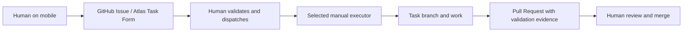
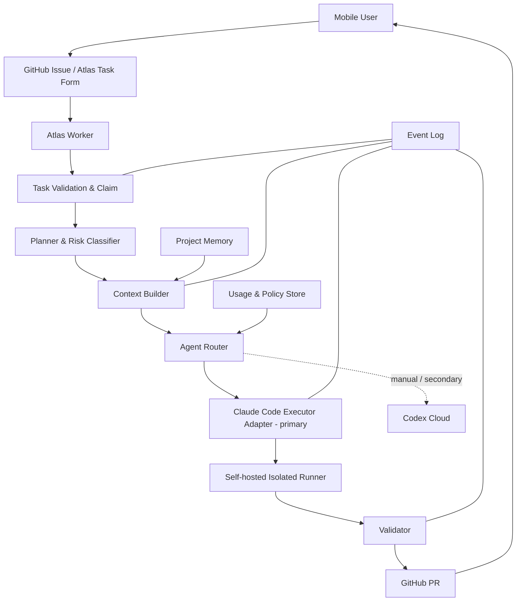
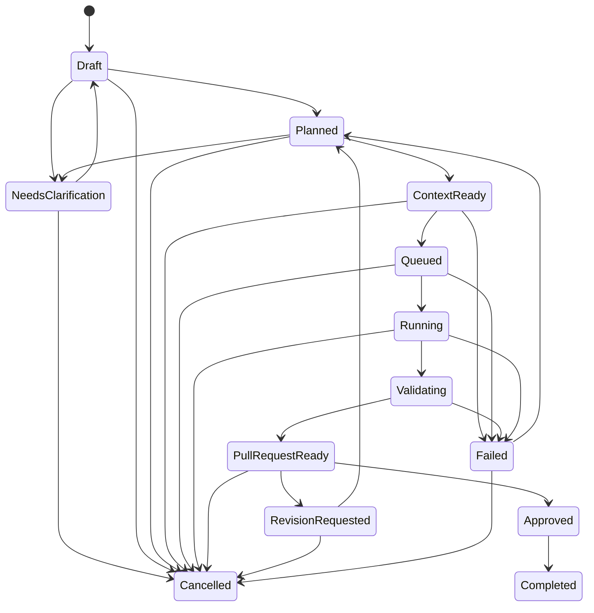

# Atlas System Architecture v0.2

> 상태: 초안
>
> 출처: [02. System Architecture v0.1](https://app.notion.com/p/3cd9f036b307811fb47ced775f939767) (2026-08-31 동기화)

> 운영 모델: [ADR-001](adr/0001-documentation-source-of-truth.md), [ADR-002](adr/0002-initial-mobile-task-channel.md), [ADR-003](adr/0003-initial-execution-environment.md) Accepted

## Architecture Principles

- Control Plane과 Execution Plane을 분리합니다.
- 프로젝트 격리는 논리적 규칙이 아니라 자격증명, 경로, 런타임 수준에서 보장합니다.
- 에이전트는 교체 가능한 Adapter입니다.
- 모든 단계는 이벤트로 기록되고 재시작 가능해야 합니다.

## Current Manual Workflow

현재 repository에는 Atlas worker, webhook/polling, 자동 claim, Claude Code invocation, validation automation이 없습니다.



사람이 Issue를 Executor에게 전달하는 단계가 현재의 dispatch와 claim을 대신합니다. Executor는 branch 생성, 작업, 검증, PR 생성을 수행하지만 `main`에 직접 반영하지 않습니다.

## Target MVP Architecture



## Core Components

### 1. Task Intake

Accepted intake channel인 GitHub Issues의 Atlas Task Form을 공통 Task Schema로 변환합니다. 현재는 사람이 확인하며 Target MVP에서 Atlas worker가 자동 검증·claim합니다.

### 2. Planner & Risk Classifier

작업을 하위 단계로 나누고 읽기 전용, 문서, 코드, 인프라, 비밀정보 관련 등 위험도를 분류합니다.

### 3. Context Builder

관련 문서, 코드, Issue, PR을 선택하고 크기 제한을 적용합니다.

### 4. Memory Store

프로젝트 규칙, ADR, Task 결과, 실패 원인, 요약을 저장합니다.

### 5. Agent Router

Target MVP에서는 primary self-hosted Claude Code Executor를 선택합니다. Codex Cloud는 사람이 배정하는 manual executor 또는 secondary 경로이며 다른 Adapter도 core contract를 바꾸지 않고 추가할 수 있습니다.

### 6. Execution Runner

운영자가 관리하는 always-available server에서 self-hosted Claude Code worker가 저장소를 준비하고 Task별 격리 workspace와 branch에서 명령을 실행합니다. hosting 위치와 process model은 아직 결정되지 않았습니다.

### 7. Validator

테스트, lint, 변경 범위, 금지 파일, secret scan을 검증합니다.

### 8. Delivery Adapter

GitHub PR, Issue comment, 모바일 알림을 담당합니다. GitHub Markdown과 GitHub Task state가 canonical이며 Notion update는 선택적인 mirror 동기화일 뿐 실행 상태의 source of truth가 아닙니다.

## Initial Data Model

```text
Workspace
- id
- name
- credential_scope
- policies

Project
- id
- workspace_id
- repository
- default_branch
- context_manifest
- execution_policy

Task
- id
- project_id
- objective
- constraints
- acceptance_criteria
- risk_level
- status

Agent
- id
- role
- adapter_type
- capabilities
- availability
- budget_policy

Run
- id
- task_id
- agent_id
- branch
- status
- started_at
- completed_at
- cost

Artifact
- id
- run_id
- type
- uri
- checksum
```

## State Machine



자세한 guard, retry, authorization은 [Task State Machine](specs/task-state-machine.md)을 따릅니다.

## Execution Options

### Accepted Primary — Self-hosted Claude Code Worker

- always-available server에서 실행합니다.
- Atlas worker가 검증·claim한 Task를 Claude Code Adapter에 전달합니다.
- Task별 workspace, branch lock, timeout, command policy, redaction이 필요합니다.
- server hosting 위치, webhook/polling, process supervisor는 다음 구현 결정입니다.

### Manual / Secondary — Codex Cloud

- 사람이 Issue를 직접 전달하는 현재 manual executor로 사용할 수 있습니다.
- Target MVP에서 primary worker가 실행할 수 없을 때 secondary 경로로 유지합니다.
- 자동 fallback 여부는 아직 결정되지 않았습니다.

### Deferred Adapters

- 개인 PC Runner와 다른 provider adapter는 primary E2E 이후 평가합니다.
- 모든 Adapter는 같은 Task, state, validation, PR contract를 따라야 합니다.

## Recommended MVP

[ADR-003](adr/0003-initial-execution-environment.md)에 따라 primary automated path는 **GitHub Issue → Atlas worker → self-hosted Claude Code worker → validation → PR → human review/merge**입니다. Codex Cloud는 manual/secondary로 유지합니다. 이 문서는 target architecture이며 구성 요소는 아직 구현되지 않았습니다.

## Recommended Next Sprint Scope

- [ ] webhook과 polling 중 Issue 감지 방식을 결정하고 하나만 구현
- [ ] Atlas Task Form parser와 Task Schema validation 구현
- [ ] idempotent claim, lease, duplicate delivery 방지 구현
- [ ] provider-neutral Executor Adapter와 Claude Code Adapter 최소 interface 구현
- [ ] always-available server의 isolated workspace, repository allowlist, branch lock 구현
- [ ] Claude Code invocation, timeout, cancel, redaction의 최소 happy/failure path 구현
- [ ] project validation, forbidden path, secret scan을 실행하고 결과를 구조화
- [ ] PR Output Contract에 맞는 GitHub PR delivery 구현
- [ ] 문서 전용 Issue 한 건으로 E2E 검증

다음 Sprint는 위 세로 단면에 한정하며 multi-agent routing, 자동 Codex fallback, Web UI, vector memory, production deployment는 포함하지 않습니다.
