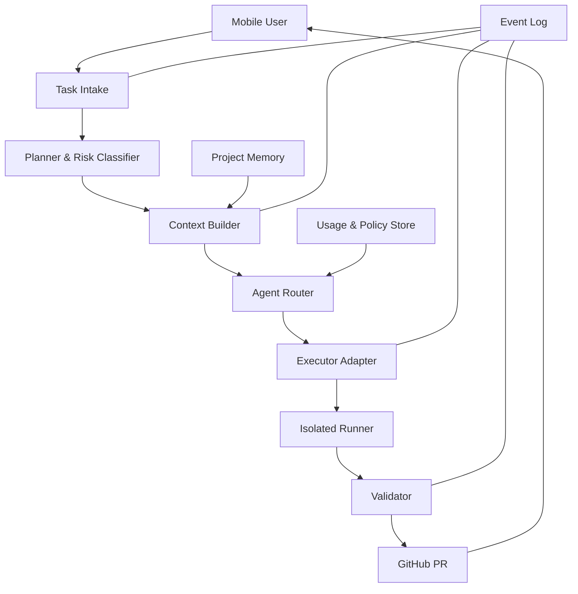
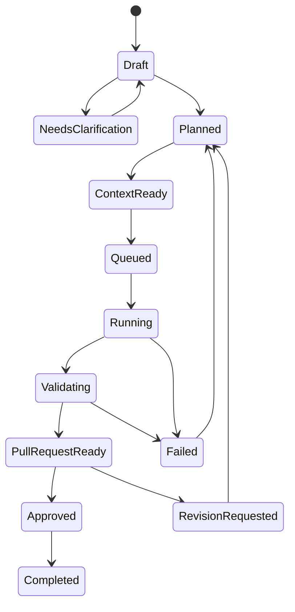

# Atlas System Architecture v0.1

> 상태: 초안
>
> 출처: [02. System Architecture v0.1](https://app.notion.com/p/3cd9f036b307811fb47ced775f939767) (2026-08-31 동기화)

## Architecture Principles

- Control Plane과 Execution Plane을 분리합니다.
- 프로젝트 격리는 논리적 규칙이 아니라 자격증명, 경로, 런타임 수준에서 보장합니다.
- 에이전트는 교체 가능한 Adapter입니다.
- 모든 단계는 이벤트로 기록되고 재시작 가능해야 합니다.

## High-Level Architecture



## Core Components

### 1. Task Intake

입력 채널의 메시지를 공통 Task Schema로 변환합니다.

### 2. Planner & Risk Classifier

작업을 하위 단계로 나누고 읽기 전용, 문서, 코드, 인프라, 비밀정보 관련 등 위험도를 분류합니다.

### 3. Context Builder

관련 문서, 코드, Issue, PR을 선택하고 크기 제한을 적용합니다.

### 4. Memory Store

프로젝트 규칙, ADR, Task 결과, 실패 원인, 요약을 저장합니다.

### 5. Agent Router

Executor의 역량, 가용성, 예산, 위험 허용치를 비교해 배정합니다.

### 6. Execution Runner

클라우드 또는 로컬/VPS에서 저장소를 clone하고 격리된 브랜치에서 명령을 실행합니다.

### 7. Validator

테스트, lint, 변경 범위, 금지 파일, secret scan을 검증합니다.

### 8. Delivery Adapter

GitHub PR, 모바일 알림, Notion 상태 업데이트를 담당합니다.

## Initial Data Model

```text
Workspace
- id
- name
- credential_scope
- policies

Project
- id
- workspace_id
- repository
- default_branch
- context_manifest
- execution_policy

Task
- id
- project_id
- objective
- constraints
- acceptance_criteria
- risk_level
- status

Agent
- id
- role
- adapter_type
- capabilities
- availability
- budget_policy

Run
- id
- task_id
- agent_id
- branch
- status
- started_at
- completed_at
- cost

Artifact
- id
- run_id
- type
- uri
- checksum
```

## State Machine



## Deployment Options

### Option A — Codex Cloud First

- 장점: 집 PC가 필요 없고 MVP를 빠르게 검증할 수 있습니다.
- 단점: 실행기 제어와 멀티 모델 확장에 제약이 있습니다.

### Option B — Home PC Runner

- 장점: 구독형 Claude Code를 활용하고 비용을 절감할 수 있습니다.
- 단점: PC 상시 전원과 네트워크가 필요합니다.

### Option C — VPS Runner

- 장점: 상시 가동하며 높은 제어권을 제공합니다.
- 단점: 서버/API 비용과 보안 운영이 필요합니다.

## Recommended MVP

Control Plane은 가벼운 웹/API 서비스로 두고, 최초 Execution Adapter는 **Codex Cloud 경로 검증을 우선**합니다. 동시에 Executor 인터페이스를 정의하여 이후 Home PC/VPS Runner를 추가합니다. 이 권고는 아직 ADR-003의 Proposed 결정입니다.

## Architecture Subtasks

- [ ] Task Schema 정의
- [ ] Project Context Manifest 정의
- [ ] Executor Adapter 인터페이스 정의
- [ ] Run State Machine 구현 명세 작성
- [ ] GitHub Delivery Adapter 명세 작성
- [ ] Validation Policy 정의
- [ ] Credential boundary 문서화
- [ ] 실패·재시도 정책 정의
- [ ] 이벤트 로그 포맷 정의
- [ ] MVP 배포 옵션 최종 선택
