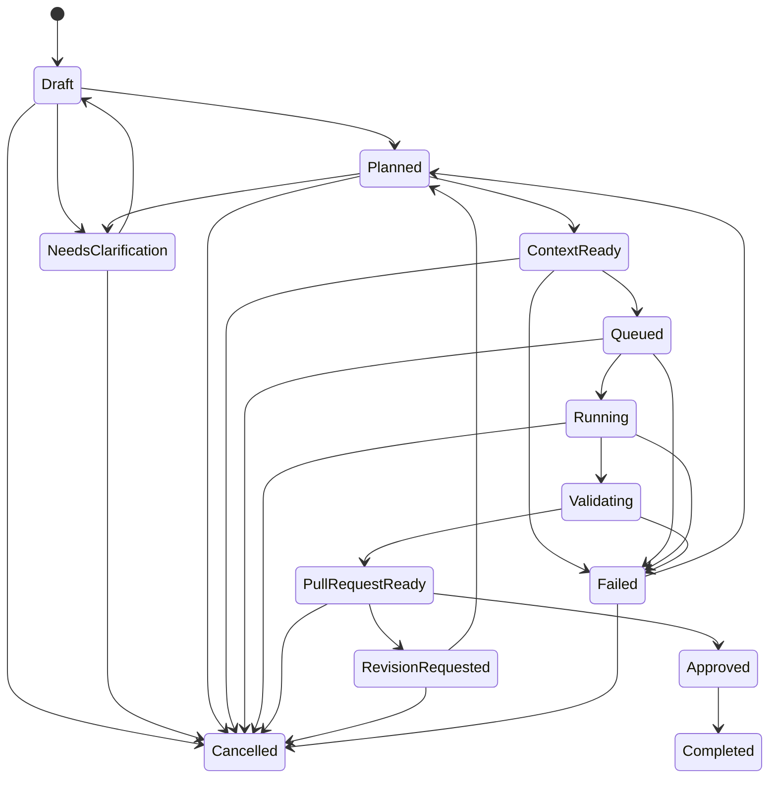

# Task State Machine v0.1

이 문서는 Atlas Task와 Run의 수명주기를 정의합니다. 상태는 UI 표시가 아니라 권한, 재시도, 감사 로그를 제어하는 계약입니다. operational state store는 [ADR-012](../adr/0012-operational-state-store.md)에서 SQLite로 확정했고 workflow engine은 [ADR-004](../adr/0004-workflow-engine.md)의 `Proposed` 방향입니다.

현재 구현된 Task 상태는 `Draft`와 `NeedsClarification`뿐입니다. poller가 valid Task를 `Draft`로 저장하고 append-only event log를 남기며, ingestion claim lease를 원자적으로 관리합니다. `Draft` 이후의 자동 transition(`Planned` 이상)은 구현되지 않았고 사람이 Issue/PR 기록으로 추적합니다.

Run은 Task와 별도의 상태 집합을 가지며 [Execution Runtime](execution-runtime.md)의 Run Lifecycle에 정의돼 있습니다. Run lifecycle, heartbeat, executor process runtime은 구현됐습니다. executor 결과가 Run status로 옮겨지지만 Task status는 자동으로 바뀌지 않습니다. Run이 `Succeeded`여도 Task는 사람 승인과 merge 전까지 `Completed`가 아닙니다. Task가 `Draft`인 동안에도 Run을 만들 수 있는데, 이는 claim이 ingestion 단계의 lease이고 Run이 그 lease 아래의 실행 시도이기 때문입니다. Run 완료가 Task 상태를 자동으로 옮기지는 않습니다.

## States

| 상태 | 의미 | 주요 책임자 |
| --- | --- | --- |
| `Draft` | 입력을 받았지만 실행 가능한지 검증되지 않음 | Task Intake |
| `NeedsClarification` | 필수 정보나 사람 판단이 부족함 | 사람 / Planner |
| `Planned` | 목표, 범위, 위험, 완료 조건과 계획이 확인됨 | Planner |
| `ContextReady` | 정책과 Task 관련 컨텍스트 packet이 준비됨 | Context Builder |
| `Queued` | 승인된 실행 대기열에 들어감 | Router / Scheduler |
| `Running` | 격리된 Runner에서 작업 중 | Executor |
| `Validating` | 변경과 Acceptance Criteria를 검증 중 | Validator |
| `PullRequestReady` | 검증 결과가 포함된 PR이 사람 검토를 기다림 | Delivery Adapter |
| `RevisionRequested` | 사람이 변경을 요청해 재계획이 필요함 | 사람 / Planner |
| `Approved` | 사람이 PR 결과를 승인했지만 완료 처리가 남음 | 사람 |
| `Completed` | 승인된 결과가 전달되고 Task가 종료됨 | Control Plane |
| `Failed` | 단계가 실패했고 원인과 재시도 가능성이 기록됨 | 실패 단계 owner |
| `Cancelled` | 사람 요청 또는 정책에 따라 작업이 안전하게 종료됨 | 사람 / Control Plane |

`Completed`와 `Cancelled`는 terminal state입니다. `Failed`는 원인과 retry policy에 따라 다시 `Planned`로 이동할 수 있습니다.

## State Diagram



기존 Architecture v0.1 상태에 모바일 취소 요구사항을 반영해 `Cancelled` terminal state를 명시적으로 추가했습니다. 별도의 `Cancelling` 중간 상태가 필요한지는 Runner 취소 PoC 후 결정합니다.

## Transition Contract

| 현재 | 다음 | Trigger | Guard / 필수 근거 |
| --- | --- | --- | --- |
| `Draft` | `NeedsClarification` | Intake 검증 실패 | 누락·모순 질문 목록 |
| `Draft` | `Planned` | `/atlas plan` 또는 Planner | Task Schema의 Planned 필드 완성 |
| `NeedsClarification` | `Draft` | 사람 답변 | source와 답변 audit 기록 |
| `Planned` | `ContextReady` | Context Builder 완료 | 필수 policy, source, selection reason |
| `ContextReady` | `Queued` | 현재: 사람 전달 / 목표: worker queue trigger | 권한, 위험, availability, 승인 확인 |
| `Queued` | `Running` | 현재: Executor 시작 / 목표: worker claim lease | branch/workspace lock과 Run ID |
| `Running` | `Validating` | Executor 결과 제출 | diff와 artifact checksum |
| `Validating` | `PullRequestReady` | 필수 검증 통과 | [PR Output Contract](pr-output-contract.md) 충족 |
| `PullRequestReady` | `RevisionRequested` | PR change request 또는 `/atlas revise` | 수정 지시와 actor |
| `RevisionRequested` | `Planned` | 재계획 완료 | 기존 Task와 revision 연결 |
| `PullRequestReady` | `Approved` | 사람 PR approval | 승인 actor와 commit SHA |
| `Approved` | `Completed` | 결과 전달 확인 | PR merge 또는 합의된 delivery evidence |
| 비terminal | `Failed` | 단계 오류 | 실패 종류, redacted error, retryability |
| 허용 상태 | `Cancelled` | `/atlas cancel` | 권한 있는 actor, 사유, 정리 결과 |
| `Failed` | `Planned` | `/atlas retry` 또는 policy | retry budget과 변경된 계획 |

## Entry and Exit Rules

### `NeedsClarification`

- 질문은 한 번에 답할 수 있도록 구체적으로 작성합니다.
- 답변 전에는 Context Builder나 Executor를 시작하지 않습니다.
- 고위험 모호성은 기본값으로 보완하지 않습니다.

### `Queued`

- 정확한 Project, repository, base branch가 고정되어야 합니다.
- Executor capability와 availability가 확인되어야 합니다.
- 고위험 변경의 사전 승인이 기록되어야 합니다.
- 동일 branch를 점유한 다른 Run이 없어야 합니다.
- Current manual workflow에서는 사람의 명시적 전달이 queue 승인 증거입니다.
- Target MVP에서는 Atlas worker의 idempotent claim과 유효한 lease가 필요합니다.

### `Running`

- Run은 고유 ID, dedicated branch, worktree/clone, executor process, log scope, actor, 시작 시각, timeout, cancellation state를 가집니다.
- 모든 side effect는 허용된 scope와 command policy 안에 있어야 합니다.
- cancel 요청을 받으면 새 side effect를 중단하고 정리 결과를 기록합니다.
- 여러 Task가 mutable worktree를 공유하거나 여러 Run이 같은 branch를 동시에 수정할 수 없습니다.

### `Validating`

- Validator는 Executor의 완료 주장만 신뢰하지 않고 계획된 검증을 실행합니다.
- 실행하지 못한 검증은 pass가 아니라 `not_run`과 이유로 기록합니다.
- secret scan, forbidden path, 변경 범위 검사는 생략할 수 없습니다.

### `PullRequestReady`

- PR head는 Task 전용 branch이고 base는 승인된 default branch입니다.
- PR body는 변경 파일, 검증, 위험, open question을 포함합니다.
- application code PR이면 필요한 테스트 결과가 없을 때 Ready로 이동할 수 없습니다.

## Failure Taxonomy

| 종류 | 기본 처리 |
| --- | --- |
| `clarification_required` | `NeedsClarification`으로 이동 |
| `transient_executor` | 동일 Executor 1회 retry 후보 |
| `authentication` | credential 노출 없이 중단하고 다른 Adapter 또는 사람에게 반환 |
| `usage_exhausted` | availability를 갱신하고 재라우팅 후보 |
| `validation_failed` | `Failed` 후 revision plan 필요 |
| `policy_violation` | 즉시 중단; 자동 retry 금지 |
| `project_boundary` | 즉시 중단; 사람 검토 필수 |
| `timeout` | side effect 정리 후 retryability 평가 |

provider adapter는 자기 어휘를 위 category로 옮깁니다. provider category를 이 표에 직접 추가하지 않습니다. Claude Code adapter의 매핑은 [Execution Runtime](execution-runtime.md)의 Failure taxonomy 표에 있습니다.

### 구현 결과와 Run status

executor process가 성공했다고 Run이 곧바로 `Succeeded`가 되지는 않습니다. 구현이 적용된 Run은 `AwaitingValidation`으로 전이합니다.

`AwaitingValidation`은 terminal이 아니고, Task의 active Run 슬롯을 차지하며, **heartbeat 대상이 아닙니다.** executor process가 이미 끝났으므로 heartbeat가 멈춘 것이 정상이고, 그것을 이유로 staleness reconciliation이 회수하면 정상 결과를 잃습니다. claim과 workspace는 유지되어 다음 validation slice가 같은 worktree에서 이어받습니다.

```
Running            → AwaitingValidation   (구현 적용됨)
Running            → Failed               (변경 없음 / 범위 위반 / executor 실패)
AwaitingValidation → Validating           (validation 예약 성공)
Validating         → Succeeded            (required step 전부 통과)
Validating         → Failed               (required step 실패 또는 수행 불가)
```

`Validating`은 terminal이 아니고 active Run 슬롯을 차지하며 **heartbeat 대상입니다.** 검증 process가 실제로 돌고 있으므로 heartbeat가 끊기면 stale 판정을 받아야 합니다. `AwaitingValidation`과 성질이 다른 지점입니다.

자세한 판정은 [Execution Runtime](execution-runtime.md)의 "구현 결과 판정"과 [Validation Pipeline](validation-pipeline.md)을 따릅니다.

### Run 성공 이후

Run이 `Succeeded`가 되면 [Git Publication](publication.md)이 commit·push하고 draft PR을 만듭니다.

publication은 **Run status가 아니라 별도 operational attempt**입니다. 게시에 실패해도 Run은 `Succeeded`로 남습니다. 구현과 검증이 성공했다는 사실은 전달 실패로 바뀌지 않습니다.

Task 상태는 여전히 자동으로 옮기지 않습니다. PR merge가 곧 Task 종료인지 정하지 않았으므로 PR 본문은 `Refs #N`만 쓰고 `Closes #N`을 쓰지 않습니다.

## Retry and Idempotency

- 동일 실패에 대한 자동 retry는 기본 1회이며 Task별 policy가 더 엄격하면 그 값을 따릅니다.
- command comment ID, event ID, Run ID를 idempotency key로 사용합니다.
- 동일 transition 요청을 다시 받으면 새 Run을 만들지 않고 기존 결과를 반환합니다.
- retry Run은 이전 Run, 실패 원인, 변경된 plan을 참조합니다.
- retry는 Acceptance Criteria나 scope를 몰래 변경할 수 없습니다.
- lease expiry만으로 새 Run을 만들지 않고 heartbeat, worker ownership, process identity를 reconcile합니다. 현재 구현은 heartbeat와 worker ownership까지이며 process identity 확인은 executor process가 생긴 뒤에 가능합니다.
- worker restart는 [Execution Runtime](execution-runtime.md)의 recovery 절차로 stale lease, orphan process, stale worktree를 확인합니다.

## Current and Target State Ownership

| 항목 | Current manual workflow | Target MVP workflow |
| --- | --- | --- |
| Intake validation | 사람 | Atlas worker |
| Claim / queue | 사람이 Executor에게 전달 | worker lease와 idempotency key |
| Primary execution | 사람이 선택한 Executor | self-hosted Claude Code worker |
| Secondary execution | Codex Cloud를 포함한 수동 선택 | Codex Cloud manual/secondary; 자동 fallback 미결정 |
| State record | Issue/PR comment와 사람 보고 | persisted Task state와 append-only event |
| Validation trigger | Executor와 사람이 실행 | Validator가 policy에 따라 실행 |
| Merge approval | 사람 | 사람 |

## Transition Event

모든 상태 변경은 최소한 다음 정보를 기록합니다.

```yaml
event_id: evt-unique
task_id: ATLAS-0001
run_id: run-0001
from: Queued
to: Running
trigger: scheduler_lease
actor: agent:executor-id
occurred_at: 2026-08-31T00:00:00Z
reason: self-hosted Claude Code worker claimed the task
evidence:
  branch: docs/example
  commit: null
```

로그에 secret이나 원문 credential 오류를 포함하지 않습니다.

## Authorization

- 사람만 `Queued`, `Approved`, `Cancelled`로 가는 고위험 transition을 승인할 수 있습니다.
- Current manual workflow에서는 사람이 Issue 전달로 queue를 승인합니다.
- Target MVP에서는 Atlas worker만 claim/lease transition을 기록하고 self-hosted Claude Code Executor는 자신의 Run을 `Running`과 `Validating` 사이에서만 이동하도록 제한합니다.
- Validator와 Delivery Adapter는 검증 근거 없이 `PullRequestReady`를 기록할 수 없습니다.
- AI는 `Approved` 또는 `Completed`를 사람 승인 없이 생성하지 않습니다.

## Open Questions

- Runner가 즉시 멈추지 못할 때 `Cancelling` 상태를 추가할지
- PR approval과 merge를 각각 상태로 분리할지
- timeout과 retry budget의 Task별 기본값
- Issue label을 상태의 source of truth로 사용할지 projection으로만 사용할지
- polling-first trigger의 rate-limit budget과 production scaling policy
- claim lease duration, heartbeat, abandoned Run recovery 정책
- polling interval, source revision과 approval signal idempotency key
